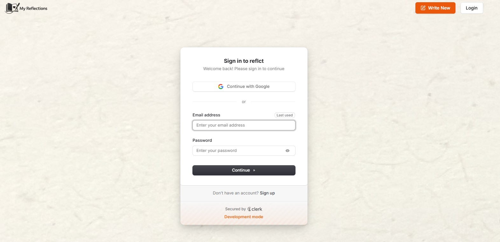
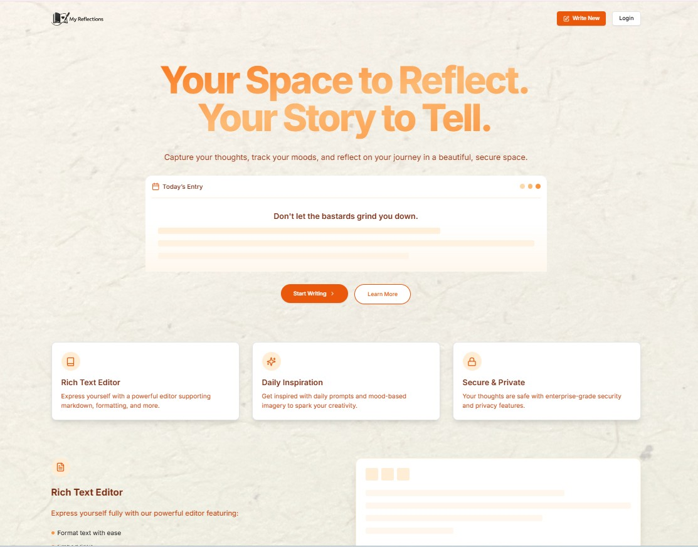
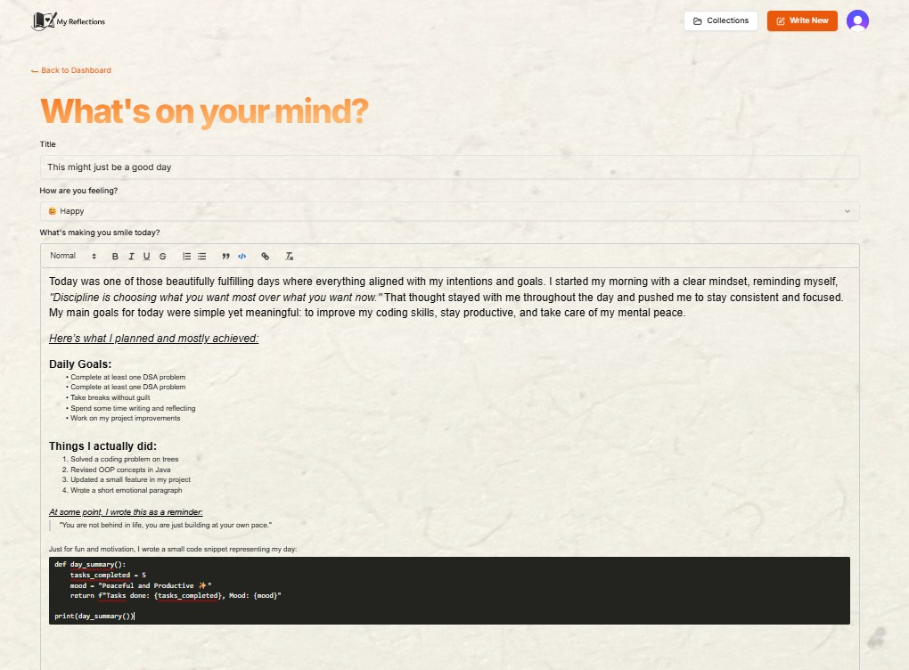
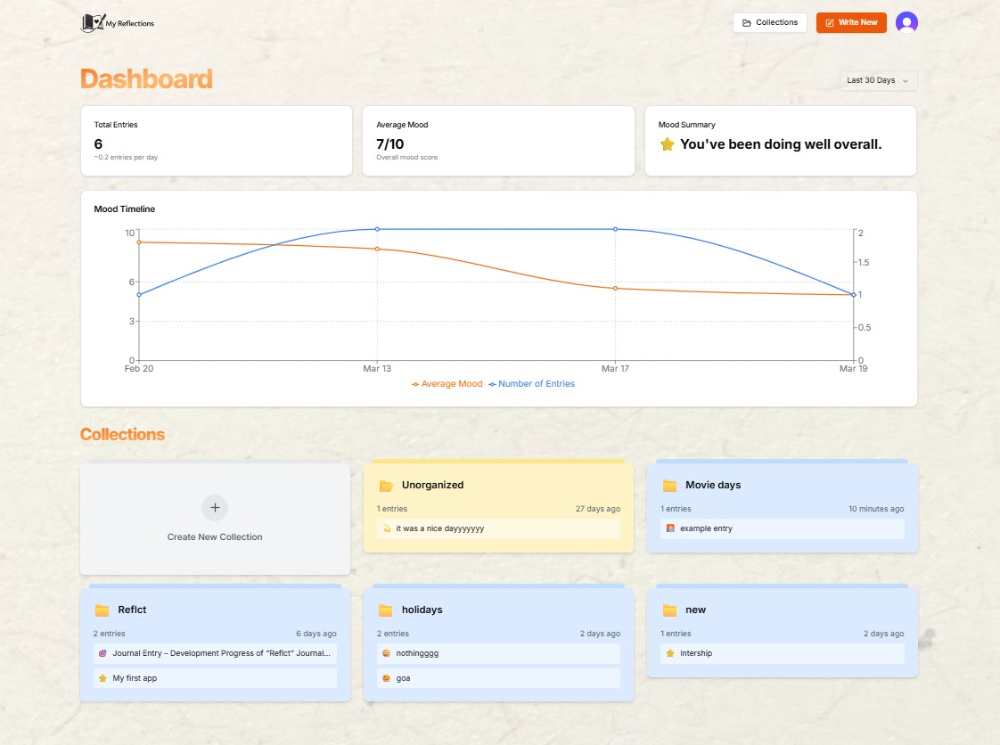
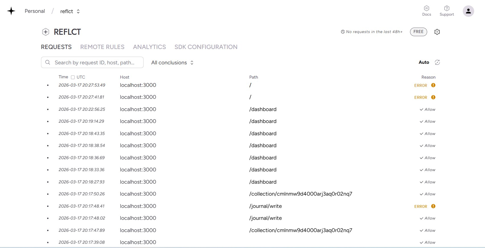

# 🌿 My Reflections - AI Journal & Mood Tracking App

  <strong>Your private AI-powered journaling companion for writing, reflecting, and understanding your emotions.</strong>

---

## ✨ Overview

Reflection is a journal app with mood tracking built to help users document their daily thoughts, track emotional well-being, and gain meaningful insights through AI.

Whether you're writing about your day, recording important memories, or reflecting on your emotions, Reflection provides a beautiful, secure, and distraction-free space for self-growth.

The application combines intelligent journaling with mood analytics, making it easier to recognize emotional patterns and maintain a healthy journaling habit.

---

## 🚀 Live Demo

🔗 **Try Reflection Here**

https://my-reflections.onrender.com

---

# 📸 Application Screenshots

> Replace these placeholders with your project screenshots.

## 🏠 SignUp Page

<!-- Add Screenshot Here -->

---

## 📖 Dashboard

<!-- Add Screenshot Here -->

---

## ✍️ Journal Editor

<!-- Add Screenshot Here -->

---

## 😊 Mood Tracking

<!-- Add Screenshot Here -->

---

## 👤 Arcjet

<!-- Add Screenshot Here -->

---

# ✨ Features

- 📝 Create and manage personal journal entries
- 🤖 AI-powered journal assistance
- 😊 Daily mood tracking
- 📊 Mood analytics and insights
- 🔒 Secure authentication
- 👤 Personalized user profile
- 📱 Fully responsive design
- 🌙 Beautiful modern UI
- ⚡ Fast performance using Next.js
- ☁️ Cloud database integration
- 📅 Organize journals by date
- 🔍 Easy navigation and clean dashboard

---

# 🛠 Tech Stack

### Frontend

- Next.js
- React.js
- TypeScript
- Tailwind CSS
- Shadcn/UI

### Backend

- Next.js Server Actions
- Clerk Authentication

### Database

- NeonDB (PostgreSQL)

### Security

- Arcjet
---
## 🛡️ Security with Arcjet

Reflection uses **Arcjet** to enhance application security and protect backend resources from malicious traffic and abuse.

### Why Arcjet?

Since the application integrates AI services and user authentication, it is important to prevent automated attacks. Arcjet provides an additional security layer before requests reach the server.

### Protection Features

- 🚫 **Rate Limiting**
  - Restricts the number of requests a user can make within a given time period.
  - Prevents API abuse and protects AI endpoints from excessive requests.

- 🤖 **Bot Detection**
  - Identifies automated bots and suspicious traffic.
  - Allows legitimate users while filtering malicious requests.

- ⚡ **Request Shielding**
  - Blocks unwanted or abnormal traffic before it reaches the application.
  - Reduces unnecessary server load.

- 🛡️ **Enhanced Backend Security**
  - Adds an extra layer of protection on top of authentication.
  - Improves the overall reliability and security of the application.

### Benefits

- Improved application security
- Better protection against spam and bots
- More reliable experience for legitimate users

# 📌 Future Improvements

- Smart Journal Search
- Journal Tags & Categories
- Emotion Prediction

---

# 🎥 Project Inspiration

This project was built while learning modern full-stack development concepts from **RoadsideCoder**

The application has been customized and extended with my own implementation, design improvements, and deployment.

